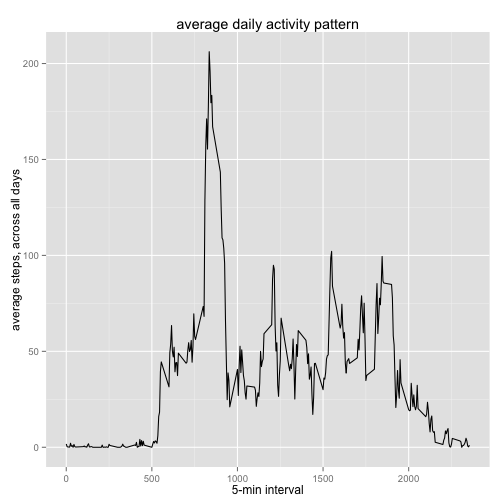
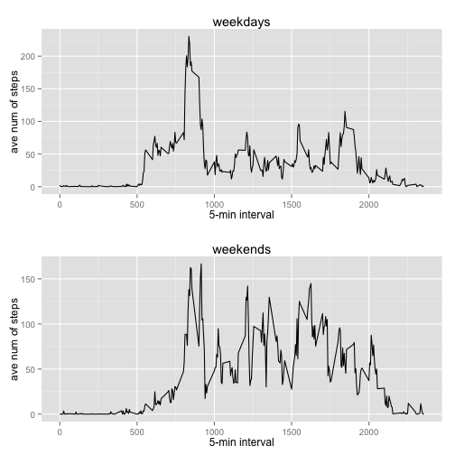

# Reproducible Research: Peer Assessment 1


## Load libraries and Set options

```r
library(ggplot2)
knitr::opts_chunk$set(echo = TRUE, cache = FALSE)
```

## Loading and preprocessing the data

1. Load the data (i.e. read.csv())


```r
data.act <- read.csv("activity.csv", header = TRUE, sep =",", quote = "\"", na.strings = "NA")
```


2. Process/transform the data (if necessary) into a format suitable for your analysis

```r
dates <- data.act$date
dates <- as.Date(as.character(dates), "%Y-%m-%d")
str(data.act)
```

```
## 'data.frame':	17568 obs. of  3 variables:
##  $ steps   : int  NA NA NA NA NA NA NA NA NA NA ...
##  $ date    : Factor w/ 61 levels "2012-10-01","2012-10-02",..: 1 1 1 1 1 1 1 1 1 1 ...
##  $ interval: int  0 5 10 15 20 25 30 35 40 45 ...
```

```r
#plot(dates, data.act$steps)
```


## What is mean total number of steps taken per day?


```r
steps.sum <- with(data.act, tapply(steps, dates, sum, na.rm = T))
str(steps.sum)
```

```
##  int [1:61(1d)] 0 126 11352 12116 13294 15420 11015 0 12811 9900 ...
##  - attr(*, "dimnames")=List of 1
##   ..$ : chr [1:61] "2012-10-01" "2012-10-02" "2012-10-03" "2012-10-04" ...
```

```r
summary(steps.sum)
```

```
##    Min. 1st Qu.  Median    Mean 3rd Qu.    Max. 
##       0    6780   10400    9350   12800   21200
```


1. Make a histogram of the total number of steps taken each day


```r
steps.perday <- data.frame(date = names(steps.sum), steps = steps.sum)
hist(steps.perday$steps, breaks = 20, main = "total number of steps taken each day", xlab = "number of steps", ylab = "frequency")
```

 


2. Calculate and report the mean and median total number of steps taken per day

--> Mean of total number of steps taken per day:

```r
mean(steps.perday$steps)
```

```
## [1] 9354
```

--> Median of total number of steps taken per day:

```r
median(steps.perday$steps)
```

```
## [1] 10395
```

## What is the average daily activity pattern?


```r
interval.mean <- with(data.act, tapply(steps, interval, mean, na.rm = T))
head(interval.mean)
```

```
##       0       5      10      15      20      25 
## 1.71698 0.33962 0.13208 0.15094 0.07547 2.09434
```

```r
steps.perint <- data.frame(interval = as.numeric(names(interval.mean)), steps = interval.mean)
```

1. Make a time series plot (i.e. type = "l") of the 5-minute interval (x-axis) and the average number of steps taken, averaged across all days (y-axis)


```r
qplot(interval, steps, data = steps.perint, geom = "line", main = "average daily activity pattern", xlab = "5-min interval", ylab = "average steps, across all days")
```

 

2. Which 5-minute interval, on average across all the days in the dataset, contains the maximum number of steps?

--> The 5-min interval which contains, on the average, the maximum number of steps:

```r
max <- max(steps.perint$steps)
steps.perint[which(steps.perint$steps == max),]
```

```
##     interval steps
## 835      835 206.2
```

## Imputing missing values

1. Calculate and report the total number of missing values in the dataset (i.e. the total number of rows with NAs)

--> The number of missing values for the steps in the dataset is:

```r
sum(is.na(data.act$steps))
```

```
## [1] 2304
```

2. Devise a strategy for filling in all of the missing values in the dataset. The strategy does not need to be sophisticated. For example, you could use the mean/median for that day, or the mean for that 5-minute interval, etc.

--> I will use the mean across all days for that interval. 

3. Create a new dataset that is equal to the original dataset but with the missing data filled in.

--> Here's the code that substitutes the mean steps across all days for missing steps per interval:

```r
act.cleaned <- data.act
# if steps is NA, use mean of steps for that interval
for (i in 1:nrow(data.act)) {
     if (is.na(data.act$steps[i])) {
          act.cleaned$steps[i] <- interval.mean[as.character(data.act$interval[i])]
     }
}
head(act.cleaned)
```

```
##     steps       date interval
## 1 1.71698 2012-10-01        0
## 2 0.33962 2012-10-01        5
## 3 0.13208 2012-10-01       10
## 4 0.15094 2012-10-01       15
## 5 0.07547 2012-10-01       20
## 6 2.09434 2012-10-01       25
```

```r
tail(act.cleaned)
```

```
##        steps       date interval
## 17563 2.6038 2012-11-30     2330
## 17564 4.6981 2012-11-30     2335
## 17565 3.3019 2012-11-30     2340
## 17566 0.6415 2012-11-30     2345
## 17567 0.2264 2012-11-30     2350
## 17568 1.0755 2012-11-30     2355
```

4. Make a histogram of the total number of steps taken each day and Calculate and report the mean and median total number of steps taken per day.


```r
steps.sumcleaned <- with(act.cleaned, tapply(steps, date, sum, na.rm = T))
steps.perdaycleaned <- data.frame(date = names(steps.sumcleaned), steps = steps.sumcleaned)

par(mfrow = c(2, 1))
hist(steps.perday$steps, breaks = 20, main = "total number of steps taken each day, with missing values", xlab = "number of steps", ylab = "frequency")
hist(steps.perdaycleaned$steps, breaks = 20, main = "total number of steps taken each day, cleaned data", xlab = "number of steps", ylab = "frequency")
```

 


--> The means and medians of the dataset with missing values compared to the cleaned dataset:

```r
c(mean(steps.perday$steps),median(steps.perday$steps))
```

```
## [1]  9354 10395
```

```r
c(mean(steps.perdaycleaned$steps),median(steps.perdaycleaned$steps))
```

```
## [1] 10766 10766
```

Do these values differ from the estimates from the first part of the assignment? 

--> Yes

What is the impact of imputing missing data on the estimates of the total daily number of steps?


```r
summary(steps.perday$steps)
```

```
##    Min. 1st Qu.  Median    Mean 3rd Qu.    Max. 
##       0    6780   10400    9350   12800   21200
```

```r
summary(steps.perdaycleaned$steps)
```

```
##    Min. 1st Qu.  Median    Mean 3rd Qu.    Max. 
##      41    9820   10800   10800   12800   21200
```

--> The summary statistics increased.

## Are there differences in activity patterns between weekdays and weekends?

1. Create a new factor variable in the dataset with two levels – “weekday” and “weekend” indicating whether a given date is a weekday or weekend day.

--> The daytype factor will contain whether the data was on a "weekday" or a "weekend"

```r
dayofweek <- weekdays(dates)
daytype = c()
for (i in 1:length(dayofweek)) { 
     daytype[i] <- if (dayofweek[i] == "Saturday" | dayofweek[i] == "Sunday") "weekend" else "weekday" 
     }
head(daytype)
```

```
## [1] "weekday" "weekday" "weekday" "weekday" "weekday" "weekday"
```

2. Make a panel plot containing a time series plot (i.e. type = "l") of the 5-minute interval (x-axis) and the average number of steps taken, averaged across all weekday days or weekend days (y-axis). The plot should look something like the following, which was creating using simulated data. Your plot will look different from the one above because you will be using the activity monitor data. Note that the above plot was made using the lattice system but you can make the same version of the plot using any plotting system you choose.


```r
data.weekday <- subset (act.cleaned, daytype == "weekday")
data.weekend <- subset (act.cleaned, daytype == "weekend")

interval.mean.day <- with(data.weekday, tapply(steps, interval, mean))
steps.perint.day <- data.frame(interval = as.numeric(names(interval.mean.day)), steps = interval.mean.day)

interval.mean.end <- with(data.weekend, tapply(steps, interval, mean))
steps.perint.end <- data.frame(interval = as.numeric(names(interval.mean.end)), steps = interval.mean.end)

require(gridExtra)
plotday <- qplot(interval, steps, data = steps.perint.day, geom = "line", main = "weekdays", xlab = "5-min interval", ylab = "ave num of steps")
plotend <- qplot(interval, steps, data = steps.perint.end, geom = "line", main = "weekends", xlab = "5-min interval", ylab = "ave num of steps")
grid.arrange(plotday, plotend, nrow=2)
```

 
